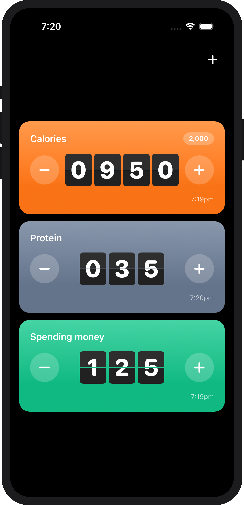
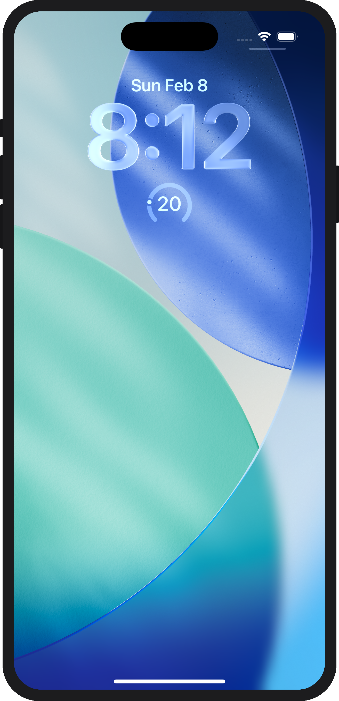
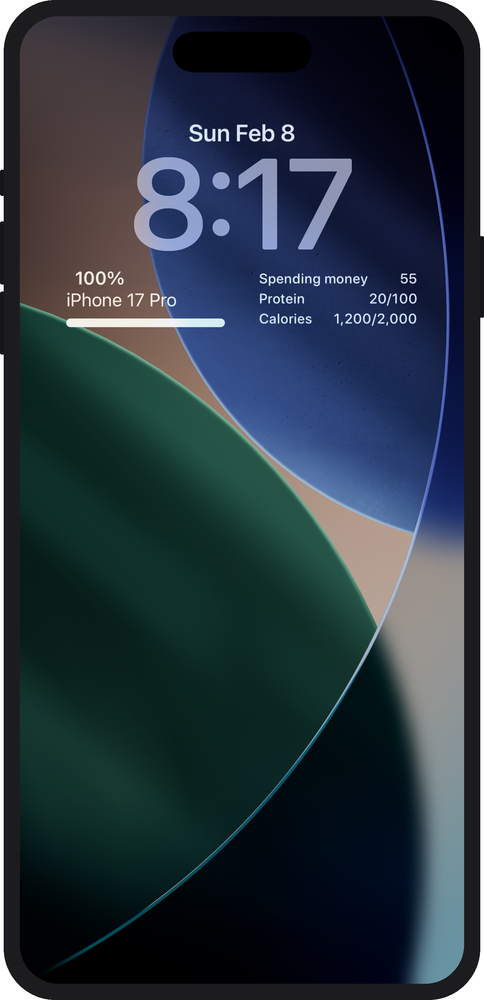

## Blip

A minimal, flip clock-style iOS counter app that supports lock screen widgets. Track macros, spending, or whatever with stylish cards that reset on your schedule.

<p align="center">
  
  
  
</p>

### Features

- Multiple counters as colored cards with animated flip clock digits
- Auto-reset on a daily, weekly, or monthly schedule
- Optional goal tracking with progress display
- Lock screen widgets — single counter (circular/inline) and multi-counter (rectangular)

### Requirements

- iOS 17+
- Xcode 16+
- [XcodeGen](https://github.com/yonaskolb/XcodeGen)

### Build

```bash
# Install XcodeGen if you don't have it
brew install xcodegen

# Generate the Xcode project and open it
xcodegen generate
open Blip.xcodeproj
```

Build and run the **Blip** scheme on a simulator or device. The widget extension is included automatically.

To build from the command line:

```bash
export DEVELOPER_DIR=/Applications/Xcode.app/Contents/Developer
xcodebuild -project Blip.xcodeproj -scheme Blip \
  -destination 'platform=iOS Simulator,name=iPhone 17 Pro' build
```
